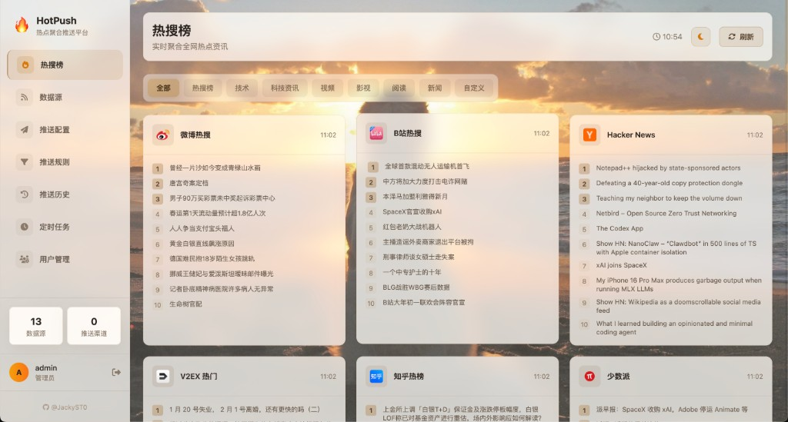
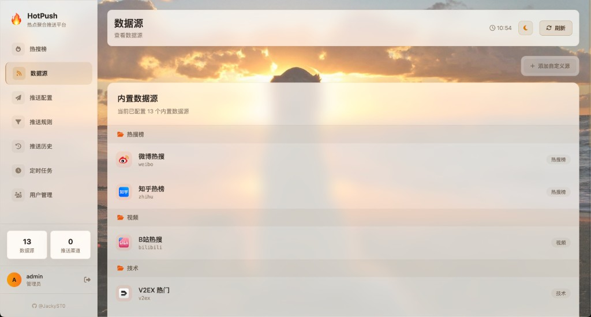
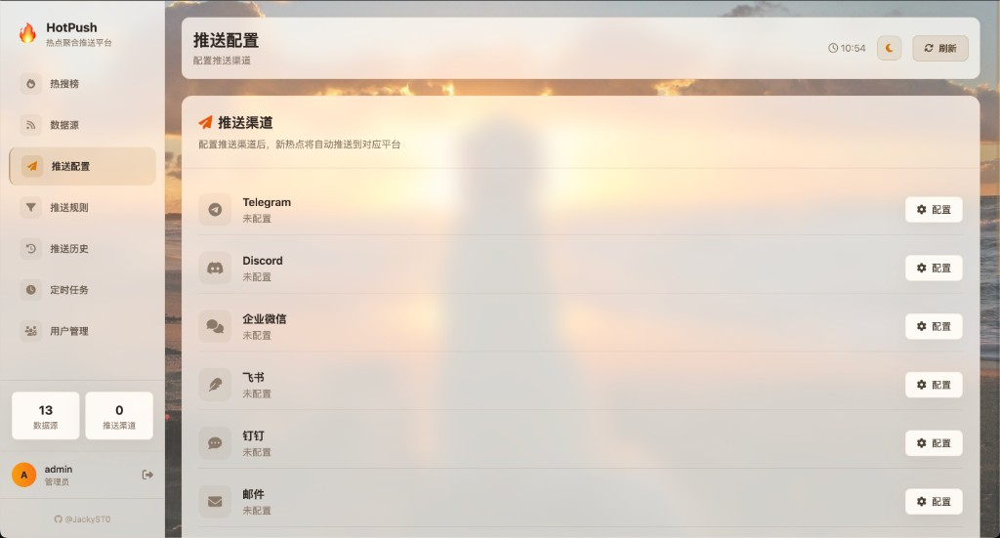
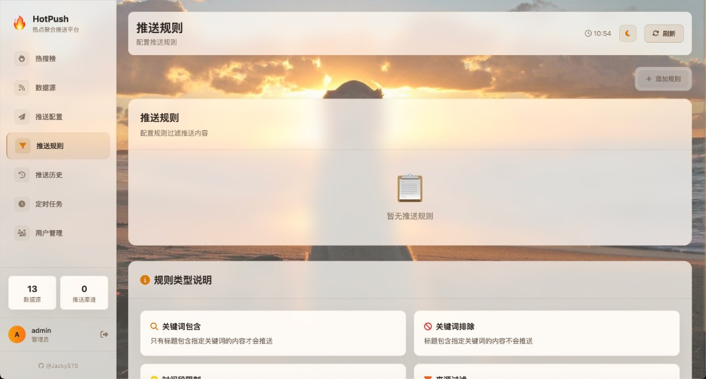
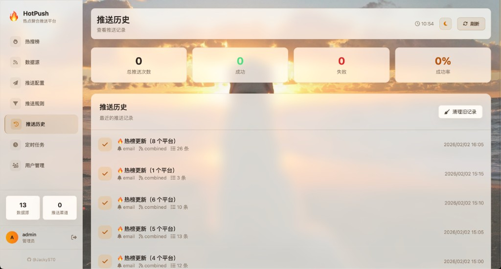
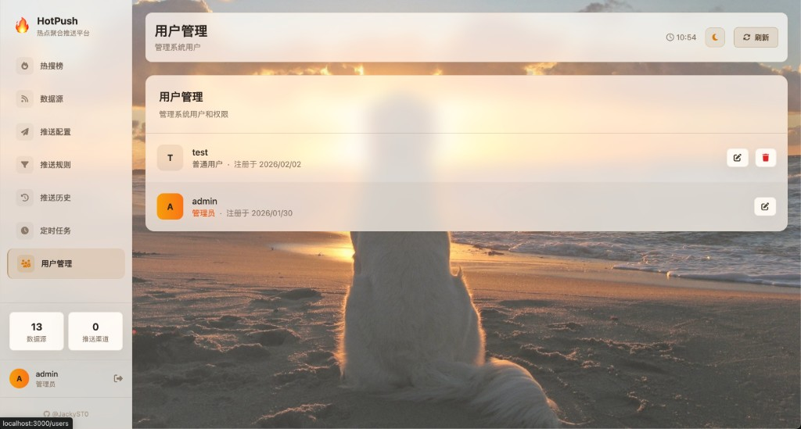

# 🔥 HotPush

> 热点聚合推送平台 - 聚合全网热点，主动推送到你指定的平台

[](https://opensource.org/licenses/MIT)
[](https://www.python.org/)
[](https://fastapi.tiangolo.com/)
[](https://vuejs.org/)

## ✨ 特性

- 🌐 **热点聚合** - 聚合微博、知乎、B站、GitHub 等 15+ 平台热榜
- 📨 **多渠道推送** - 支持 Telegram、Discord、企业微信、飞书、钉钉等
- ⚡ **实时更新** - 分钟级热点监控，第一时间推送新热点
- 🎯 **智能过滤** - 支持关键词过滤、时间段限制、来源过滤等规则
- 🎨 **现代化界面** - Vue 3 + Tailwind CSS 构建的响应式前端
- 👥 **用户管理** - 支持多用户、权限控制
- 🐳 **一键部署** - Docker 快速启动，开箱即用
- 🆓 **开源免费** - MIT 协议，自由使用

## 📸 界面预览

<details>
<summary><b>🔐 登录页面</b></summary>

</details>

<details open>
<summary><b>🔥 热搜榜 - 聚合多平台热点</b></summary>

</details>

<details>
<summary><b>📡 数据源管理</b></summary>

</details>

<details>
<summary><b>📨 推送配置 - 多渠道推送</b></summary>

</details>

<details>
<summary><b>🎯 推送规则 - 智能过滤</b></summary>

</details>

<details>
<summary><b>📜 推送历史</b></summary>

</details>

<details>
<summary><b>⏰ 定时任务</b></summary>

</details>

<details>
<summary><b>👥 用户管理</b></summary>

</details>

## 📦 支持的热榜源

| 分类 | 平台 |
|------|------|
| **热搜榜** | 微博热搜、知乎热榜、百度热搜、抖音热搜、今日头条、B站热搜 |
| **技术** | GitHub Trending、V2EX、Hacker News、掘金热榜 |
| **视频** | B站热门 |
| **科技资讯** | 36氪、少数派、IT之家 |
| **影视** | 豆瓣热映 |

## 📱 支持的推送渠道

| 渠道 | 状态 | 配置难度 |
|------|------|---------|
| Telegram | ✅ | ⭐ 简单 |
| Discord | ✅ | ⭐ 简单 |
| 企业微信 | ✅ | ⭐⭐ 中等 |
| 飞书 | ✅ | ⭐⭐ 中等 |
| 钉钉 | ✅ | ⭐⭐ 中等 |
| Webhook | ✅ | ⭐ 简单 |
| 邮件 | ✅ | ⭐⭐ 中等 |

## 🛠️ 技术栈

| 组件 | 技术 |
|------|------|
| 后端 | Python 3.11+ / FastAPI |
| 前端 | Vue 3 / Vite / Tailwind CSS |
| 数据库 | MySQL 8.0+ |
| 缓存 | Redis 6.0+ |
| 数据源 | RSSHub |

## 🚀 快速开始

### 环境要求

- Python 3.11+
- Node.js 18+
- MySQL 8.0+
- Redis 6.0+

### 方式一：Docker 部署（推荐）

```bash
# 克隆项目
git clone https://github.com/JackyST0/hotpush.git
cd hotpush

# 编辑 docker-compose.yml，配置 RSSHub Cookie（见下方说明）
# 编辑 backend/.env，配置推送渠道

# 启动
docker-compose up -d

# 访问前端 http://localhost:3000
# 访问 API http://localhost:8000
```

> ⚠️ **重要**：项目自带 RSSHub 实例，部分数据源需要配置 Cookie 才能正常使用，详见 [Cookie 配置说明](#-cookie-配置)

**默认管理员账号**：
- 用户名：`admin`
- 密码：`admin123`（请在 `docker-compose.yml` 中修改）

### 方式二：本地开发

#### 1. 启动后端

```bash
cd hotpush/backend

# 创建虚拟环境
python -m venv venv
source venv/bin/activate  # Windows: venv\Scripts\activate

# 安装依赖
pip install -r requirements.txt

# 配置环境变量
cp .env.example .env
# 编辑 .env 文件，配置 MySQL 和 Redis

# 创建数据库
mysql -u root -p -e "CREATE DATABASE hotpush CHARACTER SET utf8mb4;"

# 启动后端
uvicorn app.main:app --reload --port 8000
```

#### 2. 启动前端

```bash
cd hotpush/frontend

# 安装依赖
npm install

# 启动开发服务器
npm run dev

# 访问 http://localhost:3000
```

## 📖 API 文档

启动后访问 http://localhost:8000/docs 查看 Swagger API 文档。

### 主要接口

| 接口 | 方法 | 说明 |
|------|------|------|
| `/api/sources` | GET | 获取所有热榜源 |
| `/api/categories` | GET | 获取分类列表 |
| `/api/hot/{source_id}` | GET | 获取指定热榜 |
| `/api/hot` | GET | 获取所有热榜 |
| `/api/push/channels` | GET | 获取推送渠道状态 |
| `/api/push/test` | POST | 测试推送 |
| `/api/fetch/trigger` | POST | 手动触发抓取 |

## 🍪 Cookie 配置

部分热榜源需要配置 Cookie 才能正常获取数据，请在 `docker-compose.yml` 中的 `rsshub` 服务下配置：

| 数据源 | 环境变量 | 是否必须 | 获取方式 |
|--------|----------|----------|----------|
| 微博热搜 | `WEIBO_COOKIE` | **必须** | 登录 weibo.com → F12 → Network → 复制 Cookie |
| B站热搜 | `BILIBILI_COOKIE` | 推荐 | 登录 bilibili.com → F12 → Network → 复制 Cookie |

### 获取 Cookie 步骤

1. 使用 Chrome 浏览器登录对应网站
2. 按 F12 打开开发者工具
3. 切换到 Network（网络）标签
4. 刷新页面，点击任意请求
5. 在 Headers 中找到 `Cookie` 字段，复制完整内容

### 配置示例

编辑 `docker-compose.yml`：

```yaml
rsshub:
  environment:
    - WEIBO_COOKIE=SUB=xxx; SUBP=xxx; ...
    - BILIBILI_COOKIE=SESSDATA=xxx; bili_jct=xxx; ...
```

> 💡 Cookie 会过期，如果数据获取失败，请重新获取并更新配置

## ⚙️ 推送渠道配置

### Telegram 配置

1. 找 [@BotFather](https://t.me/BotFather) 创建 Bot，获取 Token
2. 找 [@userinfobot](https://t.me/userinfobot) 获取你的 Chat ID
3. 配置环境变量：
   ```
   TELEGRAM_BOT_TOKEN=your_bot_token
   TELEGRAM_CHAT_ID=your_chat_id
   ```

### Discord 配置

1. 服务器设置 → 整合 → Webhook → 创建 Webhook
2. 复制 Webhook URL
3. 配置环境变量：
   ```
   DISCORD_WEBHOOK_URL=your_webhook_url
   ```

### 企业微信/飞书/钉钉

1. 在群设置中添加机器人
2. 复制 Webhook URL
3. 配置对应的环境变量

## 📚 功能说明

| 模块 | 说明 |
|------|------|
| **热搜榜** | 聚合展示各平台热点，支持按分类筛选，实时刷新 |
| **数据源** | 管理内置数据源，支持添加自定义 RSS 源 |
| **推送配置** | 配置 Telegram、Discord、企业微信等推送渠道 |
| **推送规则** | 设置关键词过滤、时间段限制、来源过滤等规则 |
| **推送历史** | 查看历史推送记录，支持清理旧数据 |
| **定时任务** | 配置抓取间隔、定时摘要推送 |
| **用户管理** | 管理系统用户，设置权限（管理员可见） |

## 🗺️ 路线图

- [x] MVP：热点聚合 + 基础推送
- [x] Vue 前端管理界面
- [x] 用户系统 + 权限管理
- [x] 推送规则（关键词过滤、时间段限制）
- [x] 自定义数据源（RSS）
- [x] Redis 缓存
- [x] MySQL 持久化
- [ ] AI 摘要
- [ ] PWA 移动端支持
- [ ] 热搜趋势图表

## ❓ 常见问题

<details>
<summary><b>Q: 热搜数据获取失败？</b></summary>

1. 检查 RSSHub 服务是否正常运行：`docker logs hotpush-rsshub`
2. 部分源需要配置 Cookie（微博、B站），参考 [Cookie 配置](#-cookie-配置)
3. Cookie 可能已过期，需要重新获取
</details>

<details>
<summary><b>Q: 推送没有收到消息？</b></summary>

1. 检查推送渠道配置是否正确
2. 使用"测试推送"功能验证
3. 检查是否有推送规则过滤了所有内容
</details>

<details>
<summary><b>Q: 如何添加自定义数据源？</b></summary>

在"数据源"页面点击"添加自定义源"，输入任意有效的 RSS 地址即可。
</details>

<details>
<summary><b>Q: Docker 部署后无法访问？</b></summary>

1. 确保所有服务正常启动：`docker-compose ps`
2. 检查端口是否被占用：3000（前端）、8000（后端）
3. 查看日志定位问题：`docker-compose logs -f`
</details>

## 🤝 贡献

欢迎提交 Issue 和 Pull Request！

## 📄 License

[MIT](LICENSE)

## 📚 相关项目

| 项目 | 说明 |
|------|------|
| [awesome-rsshub-routes](https://github.com/JackyST0/awesome-rsshub-routes) | 🎯 精选 RSSHub 实用路由推荐，让你的 RSS 阅读更高效！ |

> 💡 如果你想了解更多 RSSHub 路由或添加自定义数据源，可以参考这个项目获取灵感！

## 🙏 致谢

- [RSSHub](https://github.com/DIYgod/RSSHub) - 万物皆可 RSS
- [FastAPI](https://fastapi.tiangolo.com/) - 现代 Python Web 框架
- [Vue.js](https://vuejs.org/) - 渐进式 JavaScript 框架
- [Tailwind CSS](https://tailwindcss.com/) - 实用优先的 CSS 框架
- [Vite](https://vitejs.dev/) - 下一代前端构建工具
